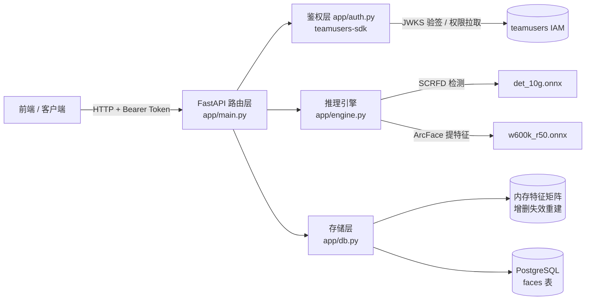

# 人脸识别后端 · 项目介绍文档

## 一、项目背景与目标

人脸签到、门禁、考勤等系统的共同核心能力是：**给定一张图片，判断图中的人是谁**。
本项目实现这一能力的后端服务——前端/客户端上传照片（可含多张人脸），服务端返回每张人脸的位置及其匹配到的 **teamusers 用户 id**。

本服务在团队微服务体系中的定位：作为一个人脸特征登记与比对的能力服务，**身份与权限完全托管给团队统一 IAM（teamusers）**，自身不签发令牌、不存人员资料，只维护 `user_id → 人脸特征` 的映射。

设计目标：

1. **可用**：识别准确率达到主流商用水平（ArcFace，LFW 99.8%+），CPU 上即可运行；
2. **易对接**：RESTful API + 自动生成的接口文档；鉴权与团队体系无缝打通；
3. **易部署**：uv 管理依赖、纯 pip 安装无需编译 C++、数据库自动建库建表；
4. **可维护**：分层清晰（路由层 / 鉴权层 / 推理层 / 存储层），配置外置。

## 二、功能列表

| 功能 | 接口 | 所需权限 |
|---|---|---|
| 登记人脸 | `POST /faces/{user_id}` | `face:modify:any` |
| 删除登记 | `DELETE /faces/{user_id}` | `face:modify:any` |
| 人脸识别 | `POST /recognize` | `face:check:any` |
| 查询/列表 | `GET /faces`、`GET /faces/{user_id}` | `face:check:any` |
| 健康检查 | `GET /healthz` | 无需鉴权 |

鉴权语义：无令牌/令牌无效 → 401；已认证但无权限 → 403。
其他异常：非法图片 400；像素超限 400；登记照无脸/多脸 422；未登记 404；超大小限制 413。

## 三、系统架构



**分层职责：**

- **路由层 `main.py`**：参数校验、大小/像素限制、登记单人脸约束、HTTP 语义；lifespan 阶段完成建库建表与模型预热；
- **鉴权层 `auth.py`**：调 teamusers-sdk 验 EdDSA 令牌（JWKS），按 `face:check:any` / `face:modify:any` 权限点放行；本服务不签发、不自验任何自定义令牌；
- **推理层 `engine.py`**：图片解码 → 小图预放大 → 人脸检测 → 512 维特征提取，全局锁保证线程安全；
- **存储层 `db.py`**：PostgreSQL 持久化（user_id + 特征 BYTEA）；检索走进程内缓存矩阵——所有向量已 L2 归一化，**点积即余弦相似度**，增删时缓存失效重建。

**识别主流程：**

```
照片 → 校验 → 解码 → 检测所有人脸（登记要求恰好 1 张，否则 422）→ 逐脸提特征
     → 与缓存特征矩阵算相似度 → 最大值 ≥ 0.45 返回对应 user_id，否则陌生人
```

## 四、关键技术选型

| 候选 | 结论 | 理由 |
|---|---|---|
| **InsightFace**（29.7k★，SCRFD + ArcFace） | ✅ 采用 | 现役主流学术+工业方案；纯 ONNX Runtime 推理，pip 即装 |
| face_recognition（dlib，56.7k★） | ❌ | 2020 年停更；模型为 2017 年水平；Windows 需编译 dlib |
| **teamusers-sdk** | ✅ 采用 | 团队统一 IAM：EdDSA 验签 + 权限缓存 + ABAC；不自建账号体系 |
| 自建 JWT 签发/校验 | ❌（初版使用后移除） | 重复造轮子，且与团队权限体系割裂 |
| **PostgreSQL** | ✅ 采用 | 生产级关系库；支持后续接 pgvector 向量索引 |
| **uv + pyproject.toml** | ✅ 采用 | 现代 Python 项目管理：锁文件、虚拟环境一体化 |
| requirements.txt | ❌（初版使用后移除） | 无锁定、无环境管理 |

## 五、核心实现细节

1. **最小数据原则**：只存 user_id 与 512 维特征向量（2KB/人），不存照片、不存姓名；人员资料查询由 teamusers 负责；
2. **权限点分离**：识别/查询（check）与登记/删除（modify）分开授权，只读账号无法污染人脸库；
3. **内存特征缓存**：识别不再每次全表扫描，增删时失效重建，万级人员单次检索 <10ms；
4. **登记单人脸约束**：登记照片含多张人脸直接拒绝，杜绝"合影登记取错人"的静默数据污染；识别接口无此限制，一张合影可同时认出多人；
5. **启动预热**：模型在服务启动阶段加载完毕，`/healthz` 就绪即代表模型可用；
6. **防御性输入校验**：文件大小（Content-Length 提前拒绝）+ 解码后像素上限（防像素炸弹）；
7. **实测数据**：已登记者相似度 1.0，陌生人 -0.09，阈值 0.45 处安全间隔充足。

## 六、运行与验证

```bash
# 前置：PostgreSQL 与 teamusers IAM 可连接
uv sync                                                        # 安装依赖
uv run uvicorn app.main:app --host 0.0.0.0 --port 18000        # 启动
uv run python smoke_test.py                                    # 冒烟测试（内置打桩 IAM，20 项断言）
```

浏览器访问 `http://127.0.0.1:18000/docs` 可查看全部接口（调试需在 Authorize 填入 teamusers 令牌）。

## 七、局限与后续方向

| 局限 | 后续方向 |
|---|---|
| CORS 默认 `*` | 生产按前端域名收紧 `FACE_CORS_ORIGINS` |
| 无活体检测，照片翻拍可欺骗 | InsightFace 2.0 官方 RGB 活体插件可直接挂载 |
| 单人单特征，侧脸/光照变化召回有限 | faces 表升级为 1 人 : N 特征 |
| CPU 串行推理，QPS 有限 | onnxruntime-gpu + CUDAExecutionProvider |
| 万级以上内存检索变慢 | PostgreSQL 侧接 pgvector 向量索引 |

## 八、许可证说明

- InsightFace **代码**：MIT，可自由使用；
- **buffalo 模型权重**：官方要求商用前邮件申请授权（recognition-oss-pack@insightface.ai）；学习、课程项目、科研不受限。
