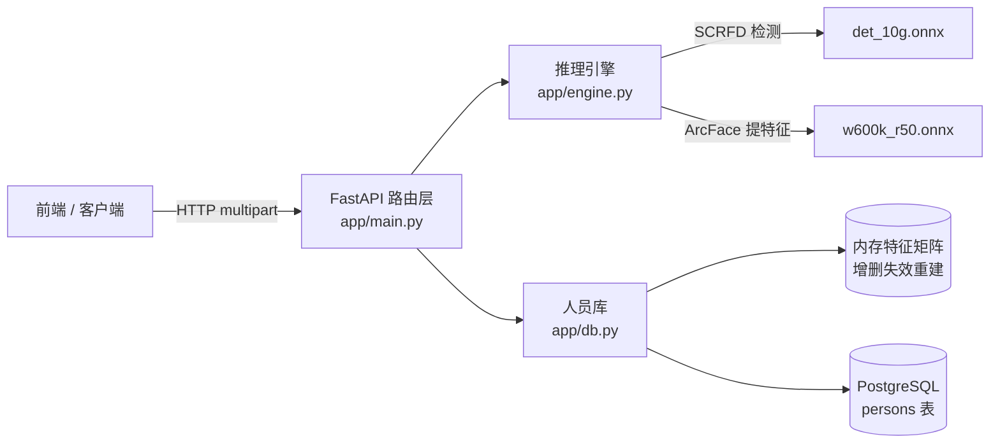

# 人脸识别后端 · 项目介绍文档

## 一、项目背景与目标

人脸签到、门禁、考勤等系统的共同核心能力是：**给定一张图片，判断图中的人是谁**。
本项目实现这一能力的后端服务——前端/客户端上传照片（可含多张人脸），服务端返回每张人脸的位置及其在人员库中的身份信息（姓名、学号、部门等自定义字段）。

设计目标：

1. **可用**：识别准确率达到主流商用水平（ArcFace，LFW 99.8%+），CPU 上即可运行；
2. **易对接**：RESTful API + 自动生成的接口文档，前端零成本联调；
3. **易部署**：纯 pip 安装，无需编译 C++；数据库自动建库建表；
4. **可维护**：分层清晰（路由层 / 推理层 / 存储层），配置外置，附带冒烟测试。

## 二、功能列表

| 功能 | 接口 | 说明 |
|---|---|---|
| 人员注册 | `POST /persons` | 姓名 + 自定义信息 + 单人照片；照片含 0 张或多张人脸时拒绝（422） |
| 人脸识别 | `POST /recognize` | 上传照片（可含多张人脸），逐脸返回位置、匹配人员及相似度；无人脸时返回空列表 |
| 人员管理 | `GET /persons`、`GET /persons/{id}`、`DELETE /persons/{id}` | 列表、查询、删除 |
| 健康检查 | `GET /healthz` | 供部署探活 |
| 接口文档 | `GET /docs` | FastAPI 自动生成的 Swagger UI，可在线试调 |
| 登录鉴权 | `POST /auth/token` | 账号密码登录签发 JWT（HS256）；业务接口必须携带 Bearer Token，否则 401 |

异常处理：非法图片 400；像素超限 400；无脸/多脸 422；人员不存在 404；超大小限制 413。

## 三、系统架构



**分层职责：**

- **路由层 `main.py`**：参数校验、大小/像素限制、注册单人脸约束、HTTP 语义，不含算法逻辑；lifespan 阶段完成建库建表与模型预热；
- **推理层 `engine.py`**：图片解码 → 小图预放大 → 人脸检测 → 512 维特征提取。全局锁保证线程安全；
- **存储层 `db.py`**：PostgreSQL 持久化（特征存 BYTEA、扩展信息存 JSONB）；检索走进程内缓存矩阵——所有向量已 L2 归一化，**点积即余弦相似度**，增删时缓存失效重建。

**识别主流程：**

```
照片 → 校验 → 解码 → 检测所有人脸（注册要求恰好 1 张，否则 422）→ 逐脸提特征
     → 与缓存特征矩阵算相似度 → 最大值 ≥ 0.45 判定为本人，否则陌生人
```

## 四、关键技术选型

| 候选 | 结论 | 理由 |
|---|---|---|
| **InsightFace**（29.7k★，SCRFD + ArcFace） | ✅ 采用 | 现役主流学术+工业方案，NIST-FRVT 冠军血统；纯 ONNX Runtime 推理，pip 即装 |
| face_recognition（dlib，56.7k★） | ❌ | 2020 年停更；模型为 2017 年水平；Windows 需编译 dlib，部署痛苦 |
| DeepFace | ❌ | TensorFlow 依赖重（~500MB），准确性与速度均不及 InsightFace |
| **PostgreSQL** | ✅ 采用 | 生产级关系库；JSONB 存扩展字段；支持后续接 pgvector 做向量索引 |
| SQLite | ❌（初版使用后替换） | 单文件单写，无法支撑多实例与并发写 |
| **FastAPI** | ✅ 采用 | 自动 OpenAPI 文档；同步路由自动进线程池，与阻塞式推理天然兼容 |

## 五、核心实现细节

1. **特征即身份**：人员库不存照片，只存 512 维特征向量（2KB/人），规避原始照片泄露风险；
2. **内存特征缓存**：识别不再每次全表扫描——库中特征在内存中维护为 numpy 矩阵，增删时失效重建，万级人员单次检索 <10ms；
3. **注册单人脸约束**：注册照片含多张人脸直接拒绝（无法确定注册对象），杜绝"合影注册取错人"的静默数据污染；识别接口则无此限制，一张合影可同时认出多人；
4. **启动预热**：模型在服务启动阶段加载完毕，首请求无需承担 ~10s 加载耗时；`/healthz` 就绪即代表模型可用；
5. **线程安全**：推理对象与数据库连接各由一把锁串行化，FastAPI 线程池下并发请求不互相踩踏；
6. **防御性输入校验**：文件大小（Content-Length 提前拒绝）+ 解码后像素上限（防像素炸弹）+ 姓名/info 长度与类型校验；
7. **实测数据**：已注册者相似度 1.0，陌生人 -0.09，阈值 0.45 处安全间隔充足。

## 六、运行与验证

```bash
# 前置：PostgreSQL 可连接（默认 127.0.0.1:5432, postgres/postgres）
pip install -r requirements.txt   # 安装依赖
uvicorn app.main:app --port 18000  # 启动（自动建库建表、预热模型）
python smoke_test.py              # 冒烟测试（21 项断言，含鉴权）
```

浏览器访问 `http://127.0.0.1:18000/docs` 可在线调试全部接口（右上角 Authorize 填入 Token）。

## 七、局限与后续方向

| 局限 | 后续方向 |
|---|---|
| 单管理员账号，无多用户/角色体系；CORS 默认 `*` | 按业务方需求接 OAuth2 / RBAC；生产收紧 `FACE_CORS_ORIGINS` |
| 无活体检测，照片翻拍可欺骗 | InsightFace 2.0 官方 RGB 活体插件可直接挂载 |
| 单人单特征，侧脸/光照变化召回有限 | 表结构升级为 1 人 : N 特征 |
| CPU 串行推理，QPS 有限 | onnxruntime-gpu + CUDAExecutionProvider |
| 万级以上内存检索变慢 | PostgreSQL 侧接 pgvector 向量索引 |
| 无审计日志 | 识别记录落库（合规场景刚需） |

## 八、许可证说明

- InsightFace **代码**：MIT，可自由使用；
- **buffalo 模型权重**：官方要求商用前邮件申请授权（recognition-oss-pack@insightface.ai）；学习、课程项目、科研不受限。
